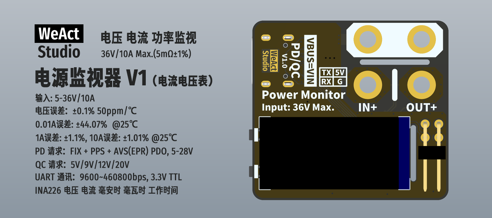
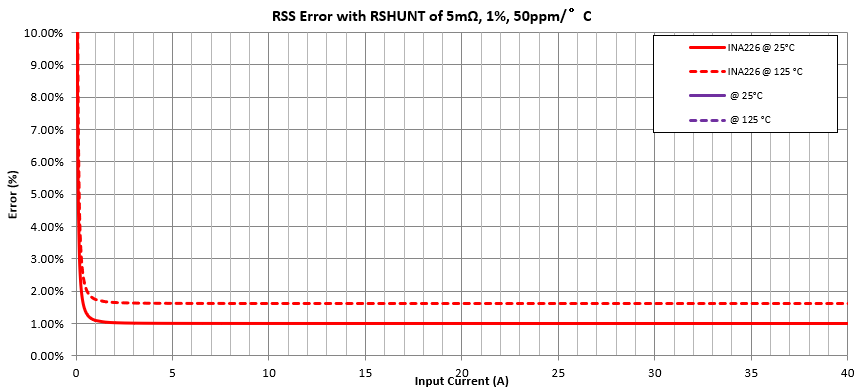
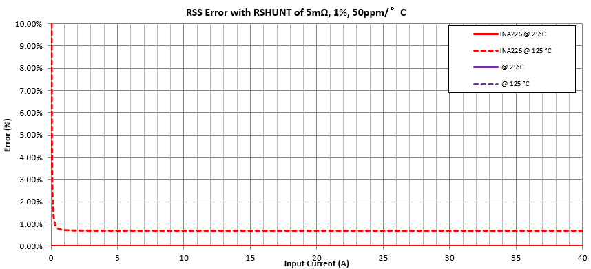
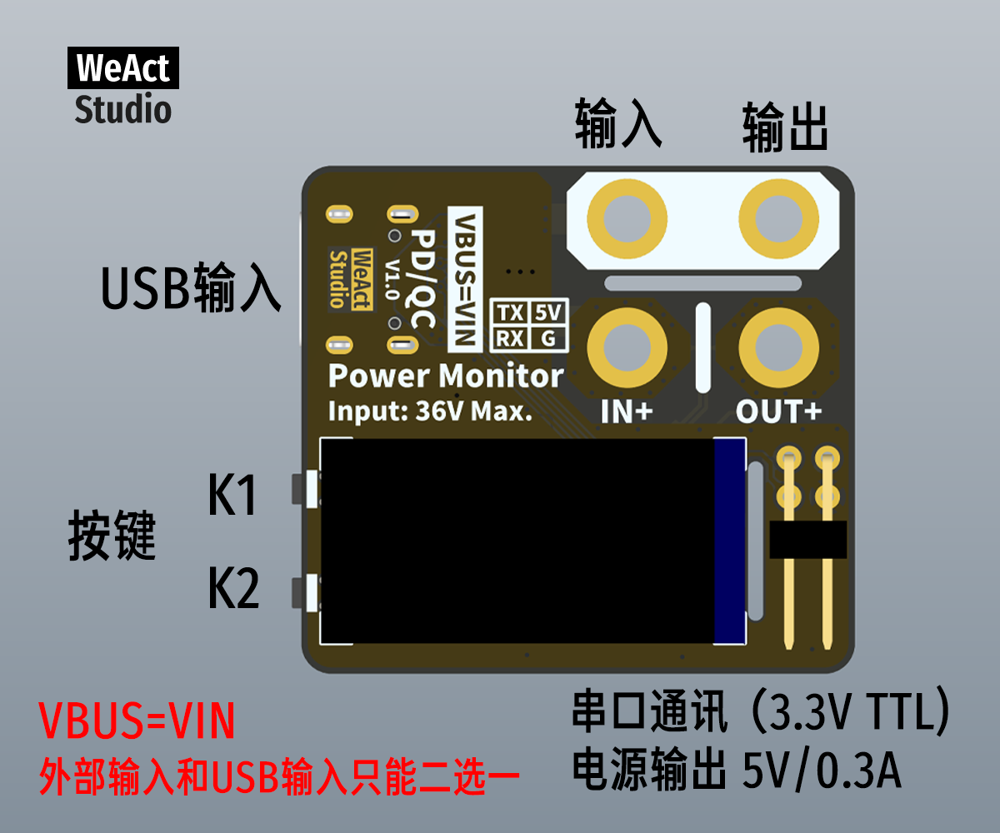
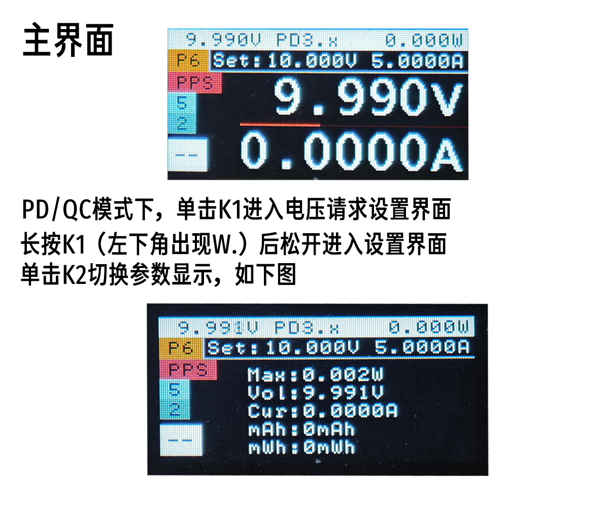
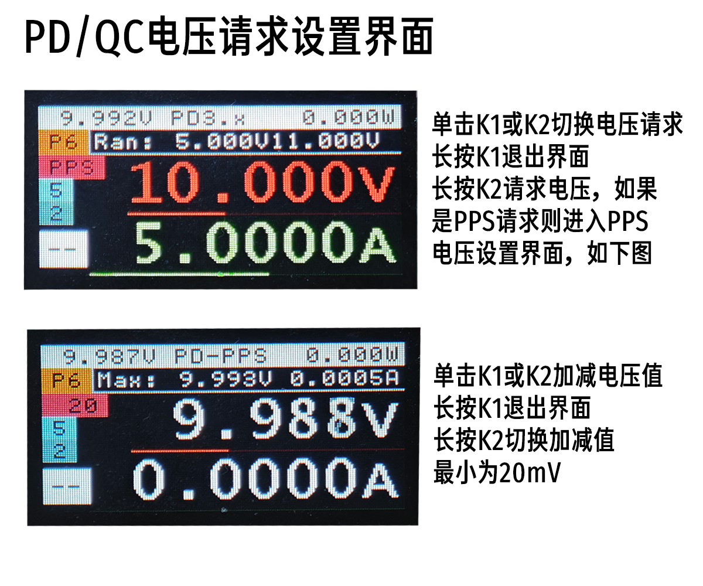
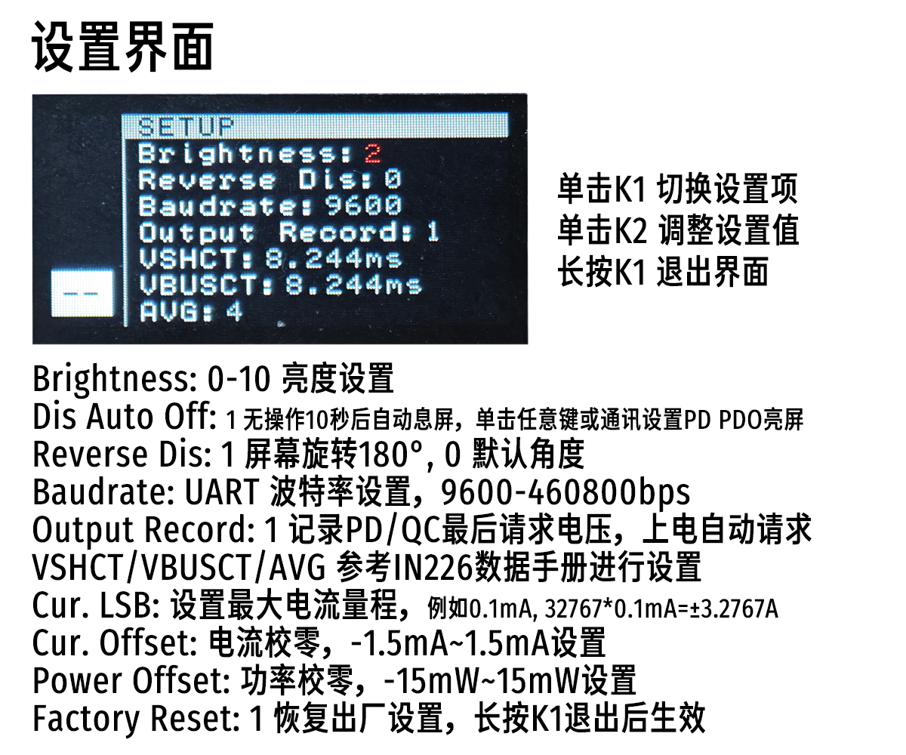

* [English version](./README.md)
# WeActStudio.PowerMonitorV1

## 误差表
> 未校准误差表



> 校准后的误差表


## 使用说明





```
/*---------------------------------------
- WeAct Studio Official Link
- taobao: WeActStudio.taobao.com
- aliexpress 1: WeActStudio.aliexpress.com
- aliexpress 2: WeActStudioOne.aliexpress.com
- github: github.com/WeActStudio
- gitee: gitee.com/WeAct-TC
- blog: www.weact-tc.cn
---------------------------------------*/
```